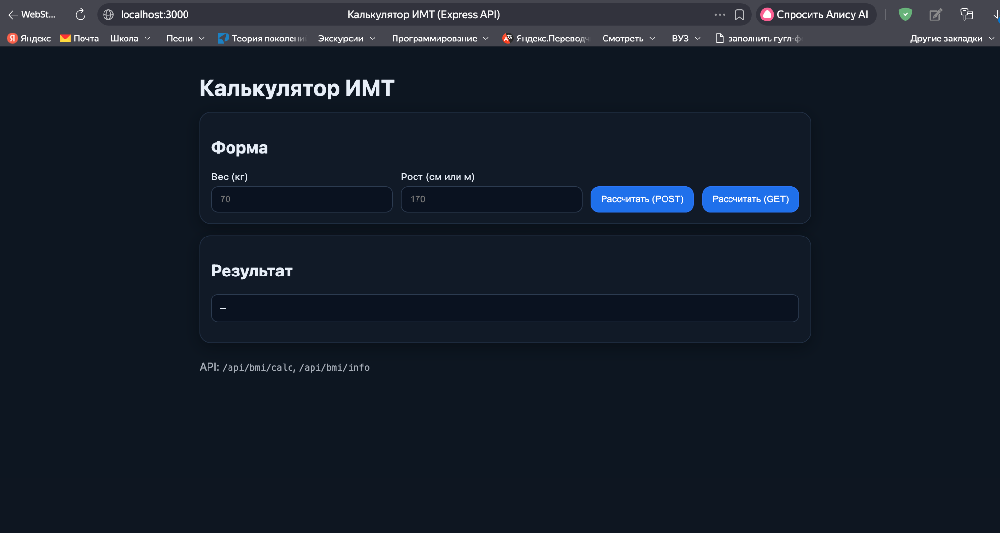
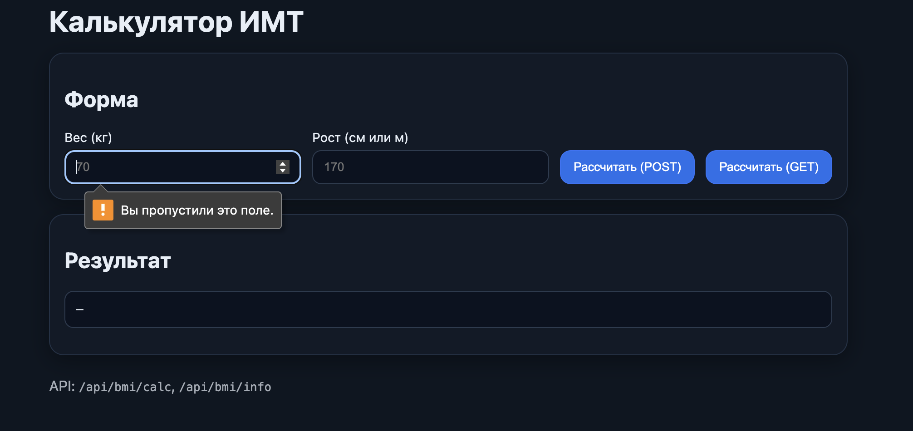
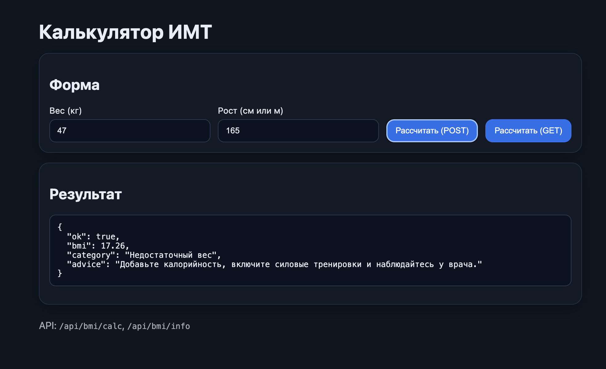
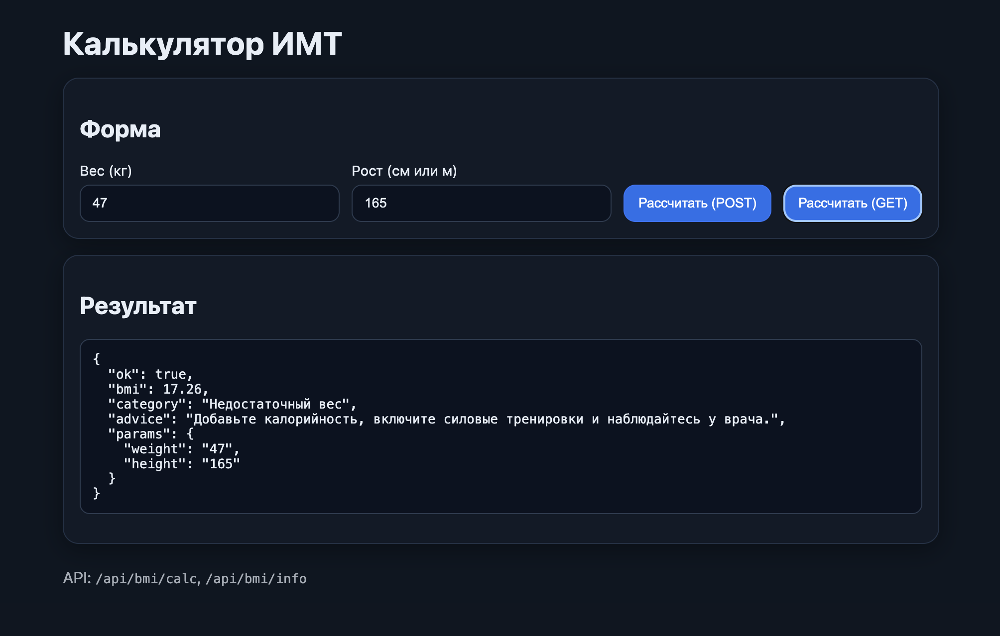
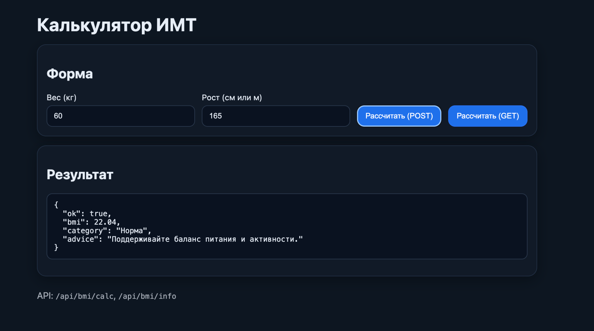
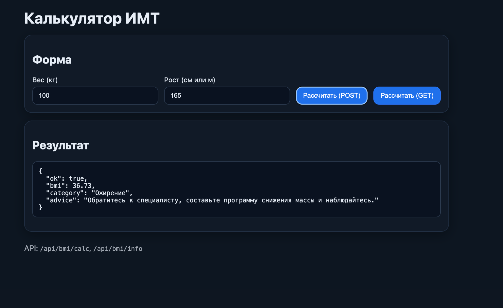

# Контрольная работа №5 — Express‑приложение «Калькулятор ИМТ (BMI)»

**Тема:** API и сервер на Express.js для расчёта индекса массы тела, с UI‑страницей, использующей это API.  

Ссылка на GitHub: https://github.com/CatherineFlower/Industrial_programming_technologies.3_sem/tree/master/KR5

## Кратко
Сервер предоставляет REST‑эндпоинты для расчёта ИМТ. На главной (`/`) отдаётся статическая HTML‑страница с формой. Пользователь может рассчитать ИМТ через **POST** (тело запроса) или **GET** (query‑параметры). Возвращается JSON с категорией и рекомендациями.

## Основные возможности
- `GET /api/bmi/info` — краткая справка по категориям ИМТ;
- `GET /api/bmi/calc?weight=70&height=170` — расчёт через query;
- `POST /api/bmi/calc` — расчёт через тело JSON (`{ "weight": 70, "height": 170 }`);
- Нормализация входа: рост можно передать в сантиметрах или метрах;
- Грейдинг категорий: недостаток веса / норма / лишний вес / ожирение;
- Рекомендации в ответе;
- Собственный middleware логгера запросов (в консоль);
- Обработка ошибок (400 — некорректные входные параметры);
- Раздача статики `public/`;
- Разнесение логики по модулям: **routes** + **controllers** + **middlewares**.

## Технологии
- Node.js + Express;
- Парсеры `express.json()` и `express.urlencoded()`;
- Архитектура: `src/app.js`, `src/routes`, `src/controllers`, `src/middlewares`;
- UI: чистый HTML + JS из `public/`, запросы к API через `fetch`.

## Структура репозитория
```
KR5/
  public/           # статика (index.html, стили и клиентский JS)
  src/
    controllers/    # вычисление ИМТ и справка
    middlewares/    # логгер, обработка ошибок
    routes/         # /api/bmi/*
    app.js          # сборка приложения, статика и мидлвары
    server.js       # точка входа (подхватывает .env PORT)
  package.json
  README.md         # этот файл (для корня ТИП положите копию)
```

## Запуск
```bash
cd KR5
npm i
# при необходимости задайте порт:
# echo "PORT=3000" > .env
npm run dev
# затем откройте http://localhost:3000
```

## API
- **GET** `/api/bmi/info`
- **GET** `/api/bmi/calc?weight=70&height=170`
- **POST** `/api/bmi/calc` → body: `{ "weight": 70, "height": 170 }`

### Пример ответа
```json
{
  "ok": true,
  "bmi": 22.04,
  "category": "Норма",
  "advice": "Поддерживайте баланс питания и активности."
}
```

## 📸 Скриншоты интерфейса
1) Главная страница, форма до расчёта  


2) Валидация HTML5 («Вы пропустили это поле»)  


3) Пример результата — «Недостаточный вес» (POST)  


4) Пример результата — через GET, с возвратом параметров  


5) Пример результата — «Норма»  


6) Пример результата — «Ожирение»  

