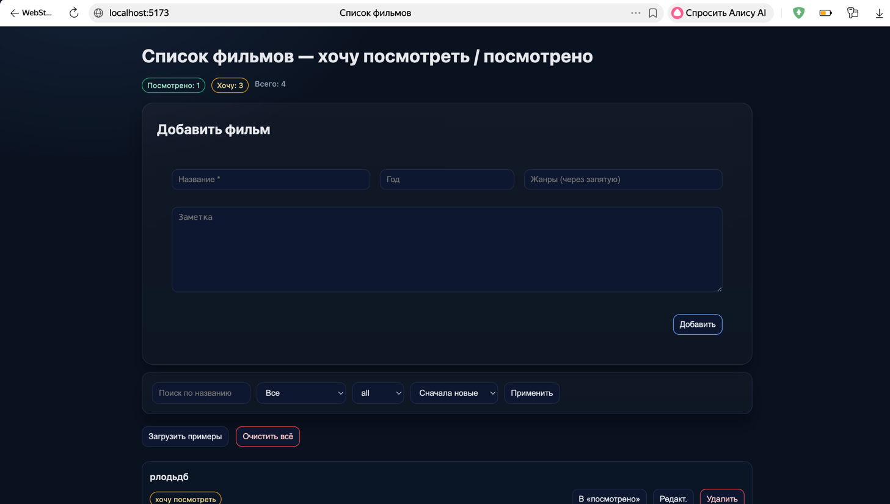
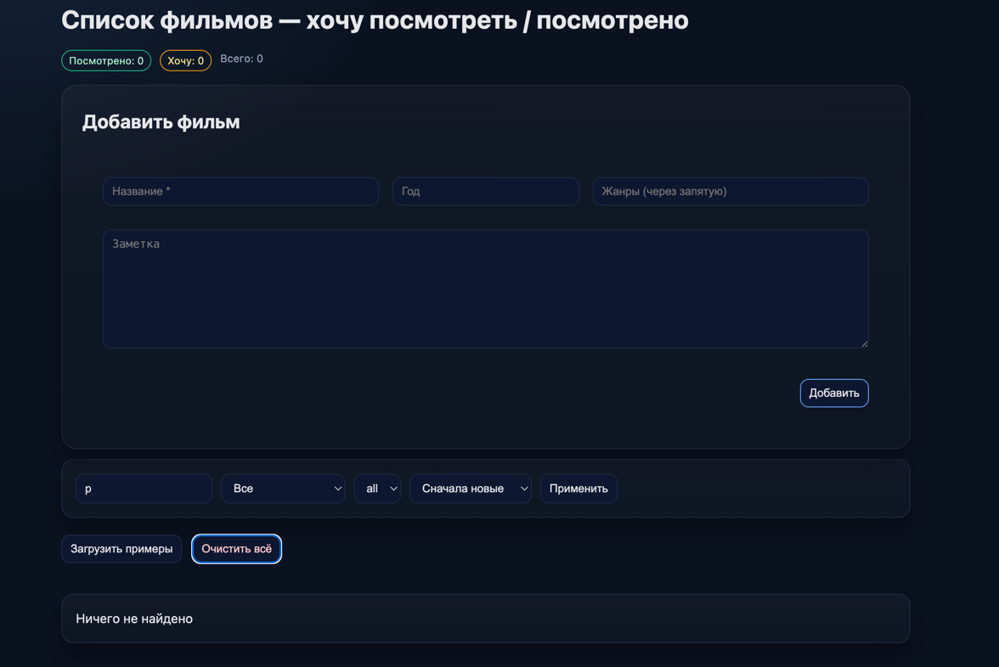
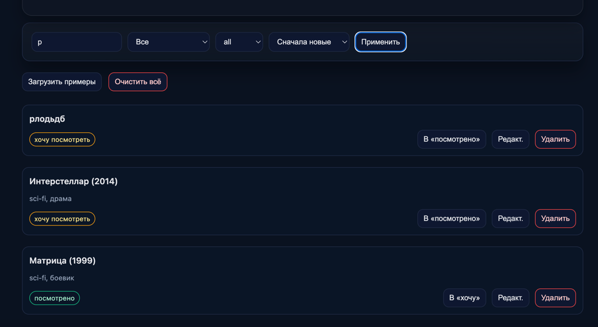
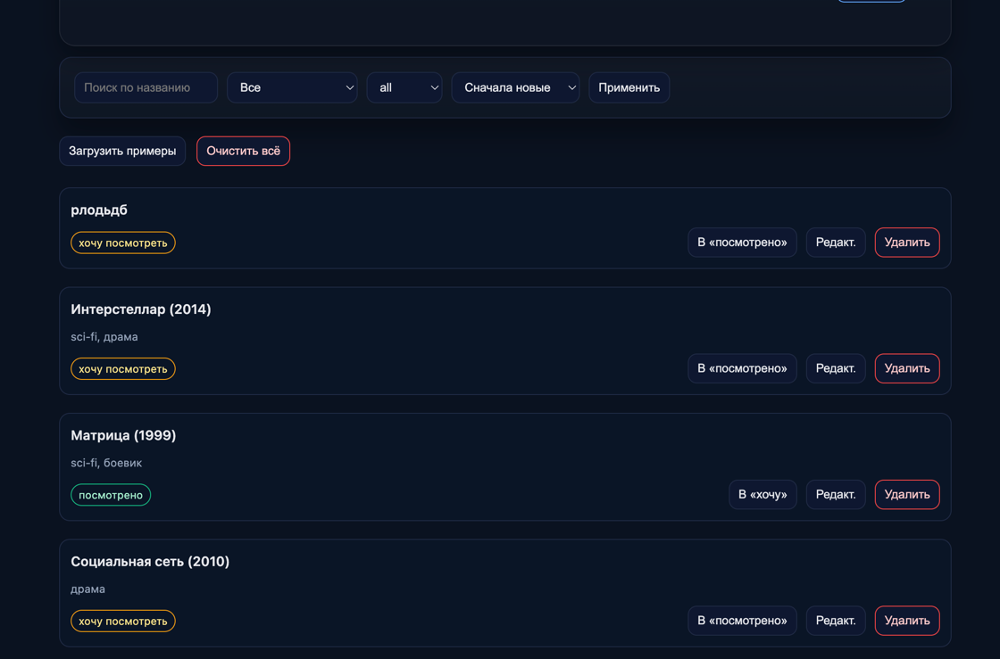
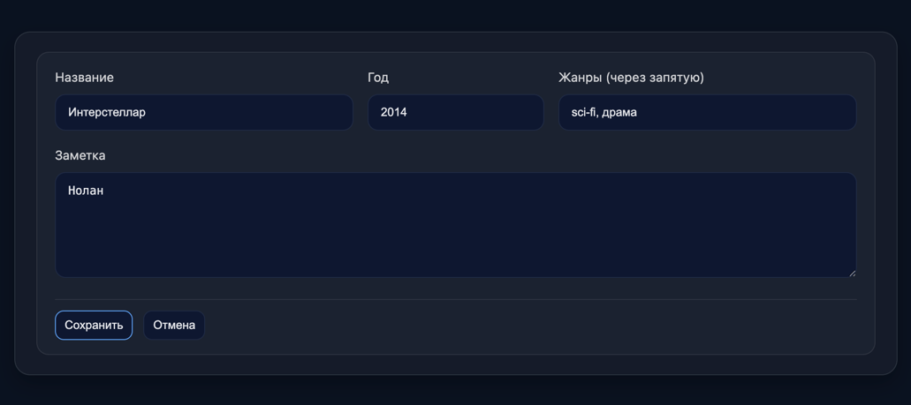

Контрольная работа №4 — React-приложение «Список фильмов»

Тема: список фильмов с двумя статусами — «хочу посмотреть» и «посмотрено».
Цель: показать владение компонентами, состоянием, событиями, хранением данных и архитектурой SPA.

Кратко:
Приложение добавляет фильмы, позволяет менять статус, искать, фильтровать и сортировать.
Данные хранятся в localStorage.

Основные возможности:
- Добавление фильма (название, год, жанры, заметка)
- Переключение статуса «хочу посмотреть» ↔ «посмотрено»
- Поиск по названию, фильтр по статусу и жанру
- Сортировка: по названию, году, дате добавления
- Редактирование/удаление
- Счётчики по статусам
- Автосохранение в localStorage
- Загрузка тестовых данных

Технологии:
- React + Vite, useReducer + Context
- Хранение: useLocalStorageReducer (синхронизация с localStorage)
- Компоненты: MovieForm, MovieList, MovieItem, Filters, Stats

Структура репозитория:
KR4/
  watchlist/
    index.html
    package.json
    vite.config.js
    src/...
README.md (этот файл в корне ТИП)

Запуск проекта:
```
cd KR4/watchlist
npm i
npm run dev
```
затем надо открыть http://localhost

## 📸 Скриншоты приложения

### 1) Главный экран (шапка, счётчики и форма добавления)


### 2) Форма добавления


### 3) Панель фильтров и действия (поиск, фильтр по статусу/жанру, сортировка)


### 4) Список фильмов — карточки, статусы и кнопки действий


### 5) Редактирование фильма (инлайн-форма c подписями и отступами)



Ссылка на GitHub: https://github.com/CatherineFlower/Industrial_programming_technologies.3_sem/tree/master/KR4/watchlist
